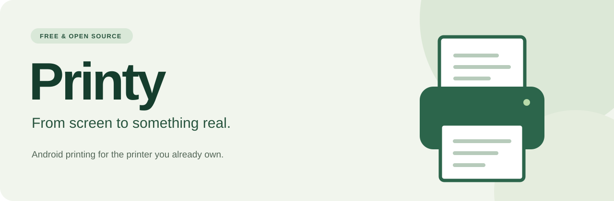
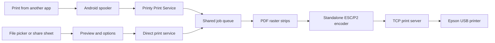

<p align="center">
  
</p>

<p align="center">
  <a href="https://github.com/neerajjayesh/printy/releases/tag/v0.1.1"></a>
  
  
  <a href="LICENSE"></a>
  <a href="https://github.com/neerajjayesh/printy/actions/workflows/build.yml"></a>
</p>

<p align="center"><strong>Your phone. Your printer. No subscription in between.</strong><br>
Free, open-source Android printing for Epson inkjets connected to a router's USB print server.</p>

<p align="center">
  <a href="https://github.com/neerajjayesh/printy/releases/tag/v0.1.1"><strong>Download Release 2</strong></a> ·
  <a href="#get-started">Get started</a> ·
  <a href="#build-it-yourself">Build from source</a> ·
  <a href="docs/HARDWARE_VALIDATION.md">Hardware testing</a>
</p>

---

Printy lets Android send documents and photos to a USB printer through a compatible network print server. It includes an Android Print Service, so saved printers can appear in the native **Print** dialog, plus its own file picker and preview.

No accounts. No ads. No analytics. No watermarks. No paid unlocks.

> [!IMPORTANT]
> **Early, experimental software.** Release 1 printed on an Epson L130 through an Airtel ZTE ZXHN F670L, but the sheet did not eject and longer documents stopped partway through. Release 2 addresses transport and job-ending issues identified during that investigation. **Successful printing with Release 2 on that setup is still awaiting confirmation.** Software tests do not establish printer compatibility.

## Downloads

| Release | Version | What it contains | Status |
| --- | --- | --- | --- |
| **[Release 2](https://github.com/neerajjayesh/printy/releases/tag/v0.1.1)** | `0.1.1` | Improved connection completion, corrected footer, copyable job details, bottom-of-page test marker | Current experimental build |
| [Release 1](https://github.com/neerajjayesh/printy/releases/tag/v0.1.0) | `0.1.0` | Initial Android app, Print Service and standalone ESC/P2 encoder | Historical build with reported stalls |

Each release includes its original **APK**, a **SHA-256 checksum**, and a tagged source snapshot. These APKs are **debug-signed development builds**, not production-signed store releases. Release 2 uses the same certificate and application ID as Release 1 and can be installed over it to preserve saved printers.

See the [changelog](CHANGELOG.md) and [verification notes](docs/VERIFICATION.md) for the differences and completed checks.

## What you can do

| Feature | Included |
| --- | --- |
| Print from other apps | Native Android Print Service and saved-printer discovery |
| Print a PDF or photo | System file picker, page preview and Gallery share-sheet support |
| Set basic options | 1–99 copies, color or grayscale, portrait or landscape |
| Choose paper | A4, Letter and 4 × 6 inches, with a white margin |
| Save several printers | Name, numeric IPv4/IPv6 address, port, exact model and last-used time |
| Check a new setup | Three-step onboarding and a one-page test print |
| Follow a job | In-app progress, notifications, cancel and copyable job details |
| Make it your own | Kotlin, Jetpack Compose, Material 3 dynamic color and a reusable JVM encoder |

## Printer and router compatibility

Profiles currently target **Epson L130, L120 and L210**, based on Gutenprint's model-80 geometry. L120 and L210 have not been physically tested. Similar Epson model names do **not** imply compatibility; other models are not advertised as supported.

You need:

- An Android phone or tablet running **Android 8.0 / API 26 or newer**.
- One of the listed Epson printers connected to a router or print server that already supports USB printer sharing.
- A reachable raw TCP printing endpoint, usually the router's LAN address on **port 9100**.
- The phone and print server on a network where they can reach each other.

Printy cannot add printer-sharing support to router firmware that lacks it. A reachable TCP port also cannot establish whether paper, ink or the attached printer is ready. The current protocol does not provide reliable jam/ink reporting through generic USB routers.

## Get started

1. Download the APK from **[Release 2](https://github.com/neerajjayesh/printy/releases/tag/v0.1.1)** and install it on your Android device.
2. Connect the printer to your router's USB port and enable printer sharing in the router's settings.
3. Open Printy. Enter the router's local IP address, select the **exact printer model**, and use port **9100** unless your print server specifies another port.
4. Load plain A4 paper and send **one test page**. Check the text, four colors, bottom marker and complete sheet ejection before printing a document.
5. For printing from other apps, open **Android Settings → Printing → Printy** and enable the service. Use the source app's **Print** action and select your saved printer.
6. Or tap **Print a file** in Printy, choose a PDF/photo, review the pages, set options and print.

The original test page placed all text in the top half of the sheet. Release 2 adds a marker near the bottom to distinguish complete raster output from a sheet that fails to eject.

### If a job stops partway through

- Cancel the active job in Printy and use the printer's Stop button to clear the stalled job. Avoid repeatedly submitting new documents into a stalled page.
- In Release 2, allow up to **90 seconds** while the app displays “Finishing the connection.” Some print servers never close their side of a finished connection.
- Tap **Copy job details** before dismissing the job card. Include those details, the printer/router model, Android version and what appeared on paper in a [bug report](https://github.com/neerajjayesh/printy/issues/new?template=bug_report.yml).
- Review the copied details before posting: they include the printer's local endpoint. Do not attach private documents, Wi-Fi passwords or credentials.

**“Sent” describes transport delivery, not confirmed physical printing.** A router can accept all bytes even if its USB printer is stalled. Canceling closes the connection, but data already buffered in the router or printer may still print. Partly sent jobs are never automatically replayed.

## What changed in Release 2

- Corrects the model-80 job footer: restore NVRAM settings (`LD`) before job end (`JE`), matching Gutenprint's command order.
- Reads incoming replies while sending, then shuts down the output side and waits for the server before fully closing the connection.
- Allows a blocked write up to 120 seconds and keeps cancellation available during sending and connection finishing.
- Stops automatic connection probes to an endpoint after a print attempt for the rest of the app process. Status cards show the last known check.
- Adds copyable byte counts, elapsed time, footer-flush state and connection-ending details. Reply payloads and document contents are not recorded in those details.
- Adds a bottom-of-page marker and regression tests for connection completion, cancellation and reset behavior.

These are candidate fixes for the reported L130/F670L issue. Their physical effect is not yet verified.

## How it works



### Android app · `app`

The app owns profile storage, document import, previews, services, progress, notifications and transport. Android's `PdfRenderer` renders at **360 DPI in 128-row strips**, avoiding a full-resolution page bitmap. Photo import handles EXIF orientation and bounds decoded image dimensions.

Native Android jobs receive the PDF page subset supplied by the spooler; Printy does not apply the original page indices a second time. Native print margins are preserved without an extra inset. Landscape rotates content while the physical paper feeds short-edge first.

One queue prevents overlapping streams. Native jobs use the bound Print Service lifecycle; direct jobs use a foreground service. Started jobs interrupted by process death are not silently replayed.

### Reusable encoder · `escp-encoder`

A plain Kotlin/JVM module with **no Android dependencies**. A row-based `RasterSource` feeds CMYK/grayscale conversion, serpentine error diffusion, two-bit drop packing, TIFF PackBits and software nozzle interleaving. `EscpEncoder` writes to any `OutputStream`.

This is a restricted implementation, not a full port of Gutenprint. It does not yet include its calibrated color/media curves, high-resolution adaptive weave or verified borderless modes. See [protocol notes](docs/PROTOCOL.md) for geometry, commands and provenance.

## Build it yourself

Use **JDK 17 or 21**, **Android SDK platform 35** and **build-tools 35.0.0**. Set `ANDROID_HOME`, or point `sdk.dir` in an untracked `local.properties` at your SDK. The Gradle wrapper pins **8.11.1** and its distribution checksum.

```sh
git clone https://github.com/neerajjayesh/printy.git
cd printy
./gradlew :escp-encoder:test :app:testDebugUnitTest :app:lintDebug :app:assembleDebug
```

On Windows, use `gradlew.bat`. The generated APK is `app/build/outputs/apk/debug/app-debug.apk`. Android Studio can open the repository directly.

Run the standalone encoder tests without an Android SDK:

```sh
./gradlew -PencoderOnly :escp-encoder:test
```

Run PDF strip-rendering tests with a connected device or emulator:

```sh
./gradlew :app:connectedDebugAndroidTest
```

GitHub Actions builds the app, runs JVM tests and lint, and runs a separate emulator job. CI build artifacts are newly built debug APKs; their signing keys can differ from the APKs attached to the two releases. Keep your release signing key private and stable when producing future updates.

### Verification so far

| Check | Release 1 | Release 2 |
| --- | --- | --- |
| Encoder JVM tests | 12 passed | 13 passed |
| App JVM tests | 4 passed | 9 passed |
| APK signature | Verified | Verified; same certificate |
| Android lint at local verification | 0 errors | 0 errors; 8 dependency-update suggestions |
| Physical printer test | L130/F670L stalls reported | Awaiting user confirmation |

The byte fixtures are derived from upstream reference commands, **not captured from a successfully verified L130 print**. Consult [verification results](docs/VERIFICATION.md), the Actions run for the relevant commit, and the [hardware checklist](docs/HARDWARE_VALIDATION.md) before drawing broader conclusions.

## Privacy

Printer profiles remain in app-private storage. Documents are copied to private cache because `PdfRenderer` requires seekable files; job-owned copies are deleted after completion, cancellation or failure. Unused import/preview files expire after 24 hours and are cleaned on startup. Import size is limited to 150 MB. Android backup is disabled.

No analytics, advertising SDKs, accounts or cloud print service are included. Printing uses an unencrypted local TCP connection, so use it on a trusted local network. Diagnostic details are copied only when you tap the button; Printy does not upload them.

## Contribute and extend

See [CONTRIBUTING.md](CONTRIBUTING.md). Hardware reports are particularly useful: record exact printer/router models and firmware, Android/app versions, paper, reproduction steps and a non-sensitive output sample.

To add another Epson model:

1. Find its entry in Gutenprint's `src/xml/printers/escp2.xml` and follow its model, baseline, ink and media tables.
2. Add an `EpsonModel` only if its command dialect, DPI, nozzle geometry, channel offsets and two-bit encoding match this backend. Different dialects need a separate strategy.
3. Add reference fixtures and raster-coverage tests. Extend paper/margin capabilities in both the encoder and Android discovery code.
4. Validate feed geometry, primary/gray ramps, channel alignment, page ejection and multi-page jobs on hardware. Record the evidence in the hardware checklist before advertising compatibility.
5. Preserve upstream attribution and license notices with every adaptation.

## Roadmap

- [ ] Confirm reliable L130/F670L printing and validate L120/L210 on real hardware.
- [ ] mDNS discovery where print servers advertise compatible endpoints.
- [ ] LPR transport with configurable queue names.
- [ ] Verified borderless photo profiles and calibrated color/media settings.
- [ ] Additional Epson model strategies, accessibility testing and localization.
- [x] Direct photo/PDF printing through Android's share sheet.

## License and acknowledgments

**GPL-2.0-or-later.** See [LICENSE](LICENSE) and [THIRD_PARTY_NOTICES.md](THIRD_PARTY_NOTICES.md).

Command sequencing and model data are adapted from [Gutenprint](https://gimp-print.sourceforge.io/), particularly its [ESC/P2 driver and model tables](https://github.com/echiu64/gutenprint/tree/a59d99151aeab80d16f64143e0af1f68e48c4af7). Credit goes to Michael Sweet, Robert Krawitz, Charles Briscoe-Smith and the Gutenprint contributors. Porting C logic to Kotlin does not remove the upstream license obligations.

Printy is an independent community project and is not affiliated with Epson, ZTE or Airtel. Product names identify tested or targeted hardware.
